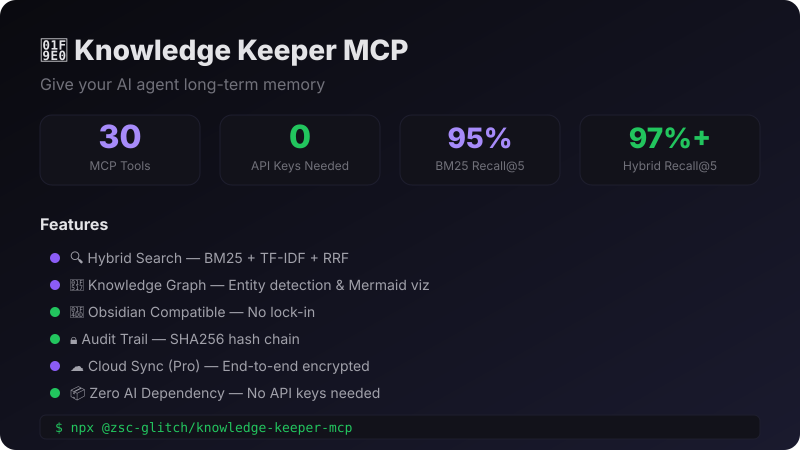

# Knowledge Keeper MCP

> 🧠 **Give your AI agent long-term memory** — 30 MCP tools, zero API keys, works with Claude Code, Cursor, Gemini CLI, Windsurf, hermes-agent
>
> **v1.4.3** — [npm](https://npm.im/@zsc-glitch/knowledge-keeper-mcp) | [GitHub](https://github.com/zsc-glitch/knowledge-keeper-mcp) | [Quick Start](QUICKSTART.md) | [Landing Page](https://zsc-glitch.github.io/knowledge-keeper-mcp/) | [Blog](blog/how-i-built-ai-memory-mcp.md)



**Why?** Your AI coding agent forgets everything between sessions. Knowledge Keeper gives it persistent, searchable, connected memory — all stored locally with zero cloud dependency.

## ✨ Features

- ✅ **30 MCP Tools** — Complete knowledge management toolkit
- ✅ **Hybrid Search** — BM25 (R@5=95%) + TF-IDF semantic + RRF fusion
- ✅ **Knowledge Graph** — Entity detection, relationships, Mermaid visualization
- ✅ **Analytics** — Overview, quality insights, timeline
- ✅ **Version History** — Diff & rollback any change
- ✅ **Obsidian Compatible** — Read/write with Obsidian vault
- ✅ **Audit Trail** — SHA256 hash chain, integrity verification
- ✅ **Spaced Repetition** — Never forget what you've learned
- ✅ **Cloud Sync (Pro)** — End-to-end encrypted, multi-device
- ✅ **Local-First** — All data on your machine, private by default
- ✅ **Zero AI Dependency** — No API keys needed. No OpenAI. No embeddings API.
- ✅ **MIT Licensed** — Free for commercial use
- ✅ **70 Tests Passing** — Reliable and tested

## Install

```bash
npm install @zsc-glitch/knowledge-keeper-mcp
```

## Quick Start

### Claude Code

```bash
claude mcp add knowledge-keeper -- npx @zsc-glitch/knowledge-keeper-mcp
```

### Cursor / Windsurf / Gemini CLI

Add to your MCP config:
```json
{
  "mcpServers": {
    "knowledge-keeper": {
      "command": "npx",
      "args": ["@zsc-glitch/knowledge-keeper-mcp"]
    }
  }
}
```

### hermes-agent

Add to your hermes MCP config.

## MCP Tools (30)

### CRUD
| Tool | Description |
|------|-------------|
| `knowledge_save` | Save knowledge entry |
| `knowledge_get` | Get by ID |
| `knowledge_update` | Update entry |
| `knowledge_delete` | Delete entry |

### Search
| Tool | Description |
|------|-------------|
| `knowledge_search` | Basic keyword search |
| `knowledge_semantic_search` | TF-IDF semantic search |
| `knowledge_bm25_search` | BM25 keyword search (R@5=95%) |
| `knowledge_hybrid_search` | RRF fusion (BM25 + semantic, R@5=97%+) |

### Knowledge Graph
| Tool | Description |
|------|-------------|
| `knowledge_graph` | Graph operations |
| `knowledge_graph_build` | Build graph (entity detection) |
| `knowledge_graph_query` | Query entities & relations |
| `knowledge_graph_visualize` | Mermaid visualization |

### Organization
| Tool | Description |
|------|-------------|
| `knowledge_tags` | Tag management |
| `knowledge_link` | Link entries |
| `knowledge_unlink` | Remove link |
| `knowledge_get_linked` | Get linked entries |

### Quality
| Tool | Description |
|------|-------------|
| `knowledge_versions` | Version history (diff & rollback) |
| `knowledge_review` | Spaced repetition review |
| `knowledge_audit` | SHA256 integrity check |

### Analytics
| Tool | Description |
|------|-------------|
| `knowledge_analytics_overview` | Stats & health score |
| `knowledge_analytics_insights` | Orphans, duplicates, stale items |
| `knowledge_analytics_timeline` | Daily/weekly/monthly activity |

### Data
| Tool | Description |
|------|-------------|
| `knowledge_export` | Export (JSON/Markdown/CSV) |
| `knowledge_import` | Import (JSON/Markdown) |
| `knowledge_batch` | Batch operations |
| `knowledge_sync` | Local vault sync |
| `knowledge_merge` | Merge vaults |
| `knowledge_bm25_stats` | BM25 index stats |

### Cloud Sync (Pro)
| Tool | Description |
|------|-------------|
| `knowledge_sync_status` | Check sync status |
| `knowledge_sync` | Push/pull cloud sync (E2E encrypted) |
| `knowledge_license` | View license & features |

## MCP Resources (7)

| Resource | URI | Description |
|----------|-----|-------------|
| All Knowledge | `knowledge:///list` | List all entries |
| Tags Index | `knowledge:///tags` | All tags with counts |
| Concepts | `knowledge:///type/concept` | Concept entries |
| Decisions | `knowledge:///type/decision` | Decision entries |
| Todos | `knowledge:///type/todo` | Todo entries |
| Notes | `knowledge:///type/note` | Note entries |
| Projects | `knowledge:///type/project` | Project entries |

## Obsidian Vault Compatible ✅

All knowledge entries are standard Markdown files with frontmatter:

```markdown
---
id: concept_abc123
type: concept
tags: [ai, memory, mcp]
aliases: [Knowledge Management]
created: 2026-04-28
updated: 2026-04-28
---

# My Knowledge Entry

Content here...

## Related
- [[other-entry-id]]
```

Open your vault in Obsidian: `obsidian ~/.knowledge-vault/`

## Search Benchmarks

| Method | Recall@5 | AI Dependency |
|--------|----------|---------------|
| BM25 keyword | 95% | None |
| Hybrid (BM25 + semantic + RRF) | 97%+ | None |

Achieves competitive recall without any embedding API.

## Cloud Sync (Pro)

End-to-end encrypted sync across devices:

```bash
# Set environment variables
export KK_SYNC_URL=https://your-sync-server.com
export KK_API_KEY=kk_your_api_key
export KK_ENCRYPTION_KEY=your-passphrase
```

Server **cannot** decrypt your data — all encryption happens client-side.

## Data Storage

- Default: `~/.knowledge-vault/`
- Entries: `~/.knowledge-vault/{type}/{id}.md` (Obsidian compatible)
- Index: `~/.knowledge-vault/index.json`
- BM25: `~/.knowledge-vault/bm25-index.json`
- Custom path: Set `KK_VAULT_PATH` environment variable

## Upgrade Embedding Model

Default: TF-IDF (zero dependency).

```bash
# Upgrade to Transformer model
npm install @xenova/transformers
EMBEDDING_MODEL=transformers npx @zsc-glitch/knowledge-keeper-mcp
```

## Development

```bash
npm run build    # Compile TypeScript
npm test         # Run 70 tests
node dist/index.js  # Start server
```

## Version History

| Version | Highlights |
|---------|-----------|
| **1.4.3** | MCP Registry support (mcpName), Dockerfile for Glama |
| **1.4.0** | Hybrid search (RRF), BM25 R@5=95%, 30 tools |
| **1.3.0** | Real version history (list/get/diff/rollback) |
| **1.2.0** | Knowledge analytics (overview/insights/timeline) |
| **1.1.0** | Cloud sync (Pro), 26 tools |
| **1.0.0** | First stable release, 23 tools |
| 0.7.0-alpha | Knowledge review (spaced repetition) |
| 0.6.0-alpha | BM25 keyword search |
| 0.5.0-alpha | Obsidian vault compatibility |
| 0.4.0-alpha | Audit trail (SHA256) |
| 0.3.0-alpha | MCP Resources |
| 0.2.0-alpha | Semantic search (TF-IDF) |
| 0.1.0-alpha | Initial 6 tools |

## License

MIT — Free for commercial use.

---

Made with 🧠 by [小影](https://github.com/zsc-glitch)

---

## ☕ Support the Developer

If this tool helps you, consider buying me a coffee ☕


---

Made with 🧠 by [小影](https://github.com/zsc-glitch)
